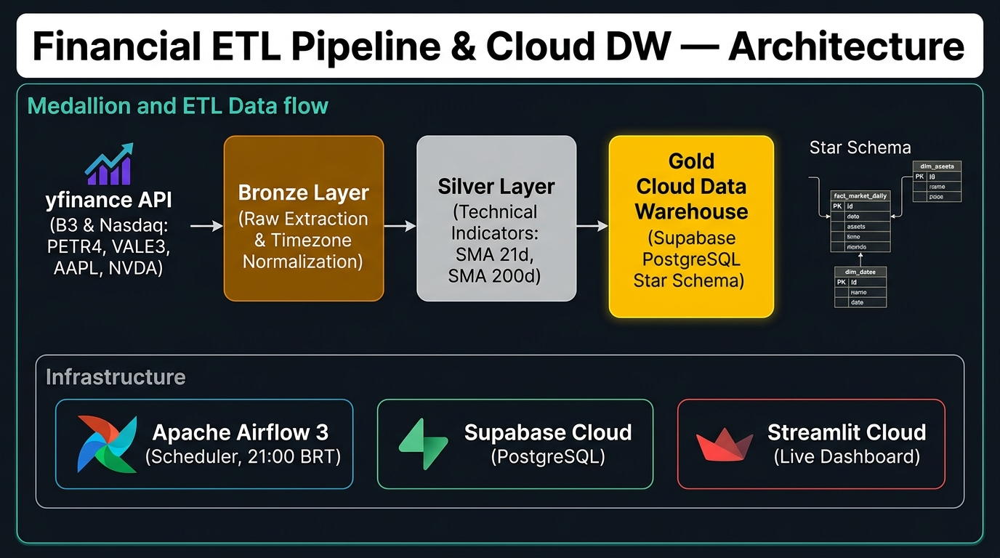
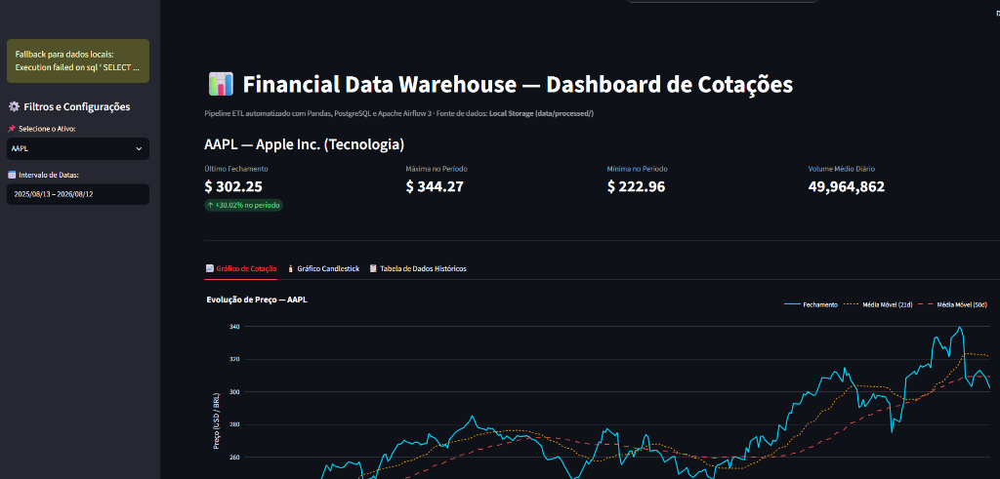
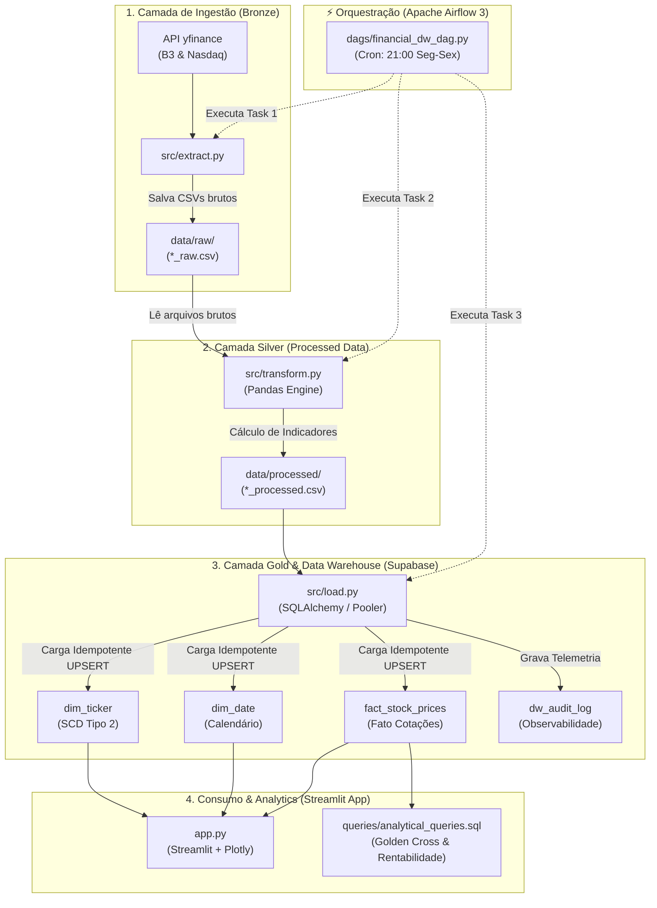

# 📊 Financial ETL Pipeline & Data Warehouse — Analytics Dashboard


*(Bilingual Documentation: [Português](#-português) | [English](#-english))*

---

## 🏗️ Architecture Blueprint / Diagrama de Arquitetura

<p align="center">
  
</p>

---

## 📋 Pré-Requisitos / Prerequisites

- **Python >= 3.12**
- **Conta no Supabase / PostgreSQL** (Gratuita - credenciais documentadas no `.env.example`)
- **Apache Airflow 3.x** (Opcional para orquestração diária agendada)

---

## 🇧🇷 Português

Pipeline de Engenharia de Dados completa de ponta a ponta (End-to-End) para extrair dados históricos do mercado financeiro (**B3 e Nasdaq**) via API `yfinance`, aplicar indicadores técnicos utilizando **Pandas**, estruturar o Data Warehouse na nuvem (**Supabase / PostgreSQL**) em **Star Schema Kimball**, orquestrar o fluxo com **Apache Airflow 3**, e disponibilizar um **Dashboard Analítico Interativo em Streamlit com Plotly**.

---

### 🖥️ Dashboard Interativo (Streamlit & Plotly)

<p align="center">
  
</p>

- **Cards de Métricas KPI:** Último Fechamento, Variação no Período %, Preço Máximo, Mínimo e Volume Médio Diário.
- **Gráficos Interativos:** Evolução de preços com Médias Móveis de 21 e 50 dias (SMA), além de visualização técnica de Candlestick (velas).
- **Conexão Híbrida Inteligente:** Consulta direta e veloz ao Supabase PostgreSQL via Star Schema com fallback automático para dados locais processados.

---

### 🏗️ Arquitetura Completa da Pipeline (Medallion, Cloud DW & Analytics)



---

### 🌟 Destaques de Engenharia

- **Arquitetura Medalhão:** Separação estrita de responsabilidade entre Bronze (dados brutos auditáveis), Silver (transformados com indicadores) e Gold (Star Schema dimensional).
- **Data Warehouse na Nuvem (PostgreSQL):** Hospedado no Supabase, otimizado com conexões via **Connection Pooler** e `SQLAlchemy`.
- **Modelagem Dimensional (Kimball):** Implementação de `dim_ticker` (com SCD Tipo 2), `dim_date` (inteligência temporal) e `fact_stock_prices` (tabela fato analítica com chaves substitutas/surrogate keys).
- **Carga Idempotente (UPSERT):** O script `src/load.py` garante que a esteira pode ser reexecutada N vezes sem duplicar registros no banco (`ON CONFLICT (ticker_key, date_key) DO UPDATE`).
- **Observabilidade & Auditoria:** Gravação automática de logs na `dw_audit_log` para monitorar duração, linhas processadas, nulos e status (`SUCCESS`/`FAILED`).
- **Orquestração (Apache Airflow 3):** DAG declarativa com políticas de *retry* automático e agendamento pós-fechamento de mercado (21h BRT).
- **Data App Interativo (Streamlit):** Interface analítica para exploração visual em tempo real com filtros por ativo e período.

---

### 📂 Estrutura do Repositório

```text
financial-etl-pipeline/
├── .env.example             # Modelo seguro de variáveis de ambiente
├── .gitignore               # Regras de versionamento e segurança
├── README.md                # Documentação oficial do projeto
├── requirements.txt         # Dependências do projeto (ETL + Streamlit)
├── app.py                   # Dashboard interativo em Streamlit & Plotly
│
├── dags/
│   └── financial_dw_dag.py  # Orquestração da pipeline no Apache Airflow
│
├── src/
│   ├── extract.py           # Ingestão de cotações via yfinance (Bronze)
│   ├── transform.py         # Transformação e indicadores via Pandas (Silver)
│   └── load.py              # Engine de Carga Idempotente no Supabase DW (Gold)
│
├── queries/
│   └── analytical_queries.sql # Queries SQL de negócio (Golden Cross, Rentabilidade)
│
├── docs/
│   └── streamlit_dashboard.png # Imagens e diagramas do projeto
│
└── data/
    ├── raw/                 # Camada Bronze: Arquivos CSV brutos
    └── processed/           # Camada Silver: CSVs transformados com indicadores
```

---

### ⚡ Ativos Monitorados

- 🇧🇷 **B3 (Brasil):** `PETR4.SA` (Petrobras), `VALE3.SA` (Vale), `ITUB4.SA` (Itaú)
- 🇺🇸 **Nasdaq (EUA):** `AAPL` (Apple), `NVDA` (NVIDIA), `TSLA` (Tesla)

---

### 🚀 Como Executar Localmente

```bash
# 1. Clonar o repositório
git clone https://github.com/loweri/financial-etl-pipeline.git
cd financial-etl-pipeline

# 2. Criar e Ativar o Ambiente Virtual
python3 -m venv .venv
source .venv/bin/activate

# 3. Instalar Dependências
pip install -r requirements.txt

# 4. Configurar as Variáveis de Ambiente
cp .env.example .env
# Edite o .env colocando a sua URI do Supabase Connection Pooler

# 5. Executar a Esteira Completa (E-T-L)
python3 src/extract.py
python3 src/transform.py
python3 src/load.py

# 6. Inicializar o Dashboard Interativo
streamlit run app.py
```

Abra `http://localhost:8501` no navegador.

---

## 🇺🇸 English

End-to-End Data Engineering and Analytics pipeline designed to extract historical market data (**B3 and Nasdaq**) via `yfinance`, compute technical indicators with **Pandas**, model a cloud Data Warehouse (**Supabase / PostgreSQL**) following **Kimball's Star Schema**, orchestrate workflows with **Apache Airflow 3**, and serve an **Interactive Analytics Dashboard with Streamlit and Plotly**.

### 🖥️ Interactive Dashboard (Streamlit & Plotly)

- **KPI Cards:** Latest Close Price, Period Return (%), High, Low, and Daily Average Volume.
- **Interactive Technical Charts:** Line charts with 21-day and 50-day Simple Moving Averages (SMA) plus Candlestick trading charts.
- **Hybrid Data Connection:** Direct queries to Supabase Cloud DW with automatic local fallback.

### 🌟 Key Features

- **Medallion Architecture:** Bronze (raw auditability), Silver (computed indicators), Gold (Dimensional DW).
- **Cloud Data Warehouse (PostgreSQL):** Hosted on Supabase, connected via **Connection Pooler** & `SQLAlchemy`.
- **Dimensional Modeling (Kimball):** `dim_ticker` (SCD Type 2), `dim_date` (Calendar), and `fact_stock_prices`.
- **Idempotent Load (UPSERT):** `src/load.py` uses `ON CONFLICT (ticker_key, date_key) DO UPDATE` to prevent duplicates.
- **Observability:** Pipeline execution telemetry logged into `dw_audit_log`.
- **Orchestration:** Declarative Apache Airflow DAG scheduled for market close (21:00 BRT).
- **Data Application:** Streamlit web interface with Plotly charting and dynamic date filters.

---

## 👨‍💻 Author / Autor

**Ericles Fernandes Oliveira** — *Data Engineer*  
GitHub: [loweri](https://github.com/loweri) | LinkedIn: [ericlesoliveira](https://www.linkedin.com/in/ericlesoliveira/)
