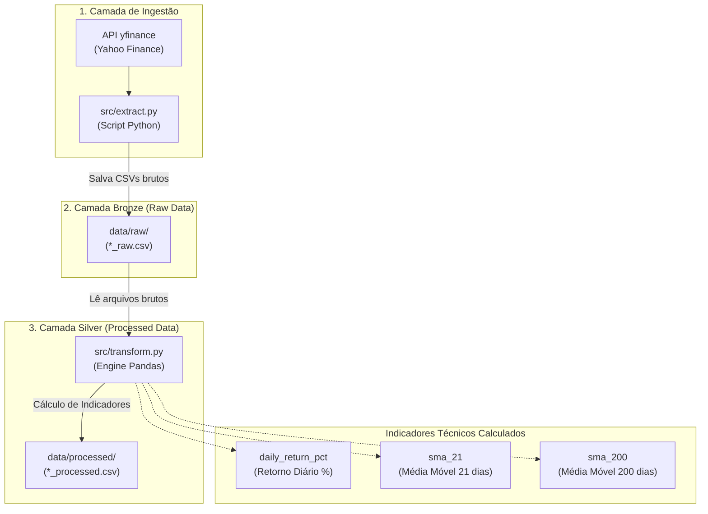
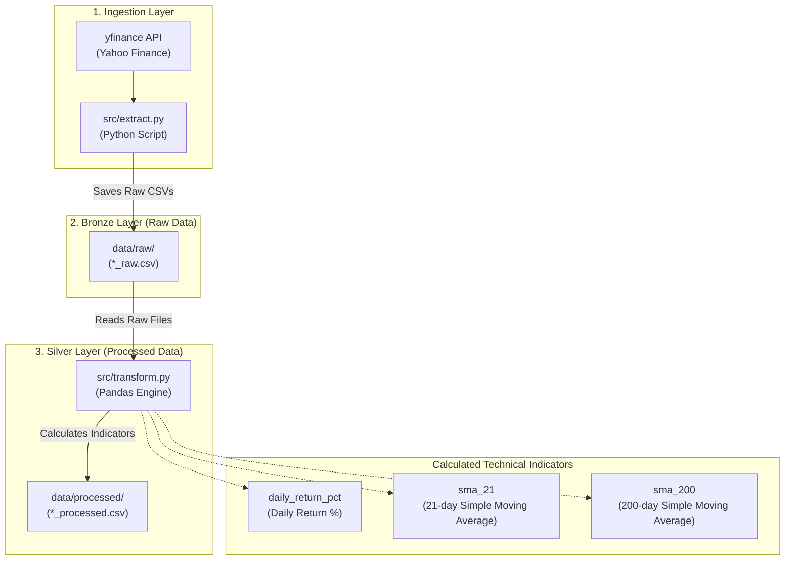

# 📊 Financial ETL Pipeline — Ingestão e Transformação de Dados Financeiros
*(Bilingual README: [Português](#-português) | [English](#-english))*

---

## 🇧🇷 Português

Pipeline de Engenharia de Dados automatizada para extrair dados históricos do mercado financeiro via API `yfinance`, aplicar indicadores técnicos utilizando **Pandas**, e organizar os dados seguindo a **Arquitetura Medalhão (Camadas Bronze e Silver)**.

### 🏗️ Arquitetura da Pipeline



### 📂 Estrutura do Projeto

```text
financial-etl-pipeline/
├── .venv/                   # Ambiente Virtual Local (Ignorado pelo Git)
├── .gitignore               # Regras de versionamento
├── README.md                # Documentação do projeto
│
├── src/
│   ├── extract.py           # Script de ingestão dos ativos via yfinance
│   └── transform.py         # Engine de transformação com Pandas
│
└── data/
    ├── raw/                 # Camada Bronze: Arquivos CSV brutos
    ├── processed/           # Camada Silver: CSVs transformados com indicadores
    └── exports/             # Camada Gold: Pronta para consumo (Próxima etapa)
```

### ⚡ Ativos Monitorados

O pipeline monitora dados diários e históricos para os seguintes ativos:
- **B3 (Brasil):** `PETR4.SA`, `VALE3.SA`, `ITUB4.SA`
- **Mercado Americano:** `AAPL`, `NVDA`, `TSLA`

### 🚀 Como Executar Localmente

```bash
# 1. Clonar o repositório
git clone https://github.com/loweri/financial-etl-pipeline.git
cd financial-etl-pipeline

# 2. Criar e Ativar o Ambiente Virtual
python3 -m venv .venv
source .venv/bin/activate

# 3. Instalar Dependências
pip install yfinance pandas

# 4. Executar Ingestão (Camada Bronze)
python3 src/extract.py

# 5. Executar Transformação (Camada Silver)
python3 src/transform.py
```

---

## 🇺🇸 English

Automated Data Engineering pipeline designed to extract historical stock market data via `yfinance`, apply technical indicators using **Pandas**, and organize the data adhering to the **Medallion Architecture (Bronze & Silver Layers)**.

### 🏗️ Pipeline Architecture



### 📂 Project Structure

```text
financial-etl-pipeline/
├── .venv/                   # Local Python Virtual Environment (Ignored)
├── .gitignore               # Version control rules
├── README.md                # Project documentation
│
├── src/
│   ├── extract.py           # Ingestion script for yfinance tickers
│   └── transform.py         # Pandas transformation engine
│
└── data/
    ├── raw/                 # Bronze Layer: Untouched raw market CSVs
    ├── processed/           # Silver Layer: Transformed CSVs with indicators
    └── exports/             # Gold Layer: Ready for consumption (Upcoming)
```

### ⚡ Monitored Assets

- **B3 (Brazil):** `PETR4.SA`, `VALE3.SA`, `ITUB4.SA`
- **US Markets:** `AAPL`, `NVDA`, `TSLA`

### 🚀 Local Setup & Run Instructions

```bash
# Clone the repository
git clone https://github.com/loweri/financial-etl-pipeline.git
cd financial-etl-pipeline

# Create & Activate Virtual Environment
python3 -m venv .venv
source .venv/bin/activate

# Install Dependencies
pip install yfinance pandas

# Run Ingestion (Bronze Layer)
python3 src/extract.py

# Run Transformation (Silver Layer)
python3 src/transform.py
```

---

## 👨‍💻 Author / Autor

**Ericles (loweri)** — *Data Engineer*
