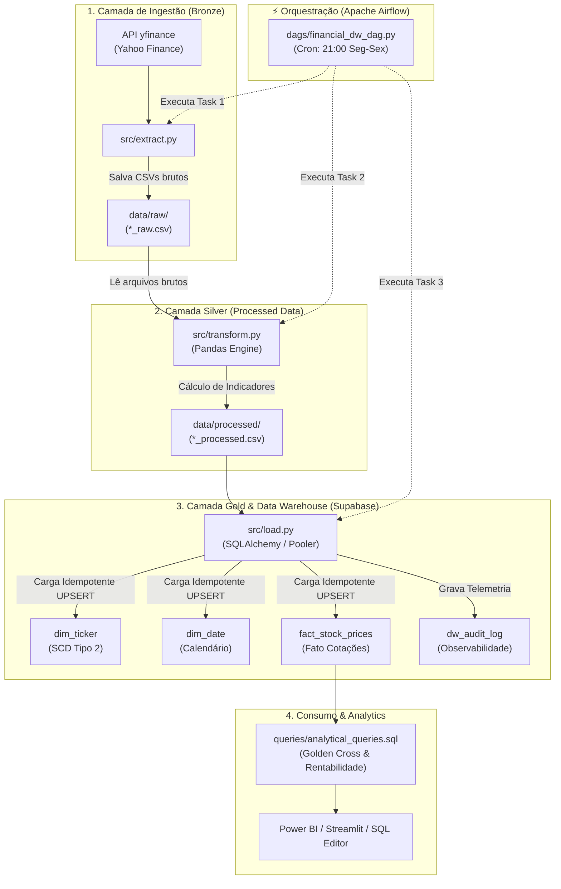
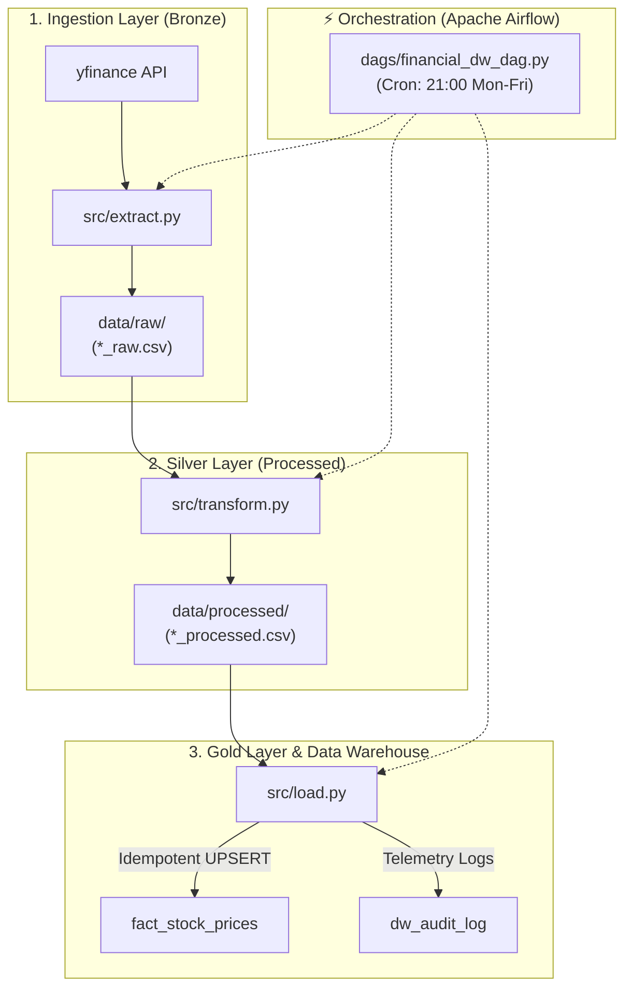

# 📊 Financial ETL Pipeline — End-to-End Data Engineering & Data Warehouse
*(Bilingual README: [Português](#-português) | [English](#-english))*

---

## 🇧🇷 Português

Pipeline de Engenharia de Dados completa de ponta a ponta (End-to-End) para extrair dados históricos do mercado financeiro via API `yfinance`, aplicar indicadores técnicos utilizando **Pandas**, estruturar o Data Warehouse na nuvem (**Supabase / PostgreSQL**) em **Star Schema Kimball**, e orquestrar o fluxo de trabalho com **Apache Airflow (DAG)**.

### 🏗️ Arquitetura Completa da Pipeline (Medallion & Cloud DW)



---

### 🌟 Destaques do Projeto

- **Arquitetura Medalhão:** Separação estrita de responsabilidade entre Bronze (dados brutos auditáveis), Silver (transformados com indicadores) e Gold (Star Schema dimensional).
- **Data Warehouse na Nuvem (PostgreSQL):** Hospedado no Supabase (SP), otimizado com conexões via **Connection Pooler** e `SQLAlchemy`.
- **Modelagem Dimensional (Kimball):** Implementação de `dim_ticker` (com SCD Tipo 2 para histórico de dados), `dim_date` (para análises de calendários/dias úteis) e `fact_stock_prices` (tabela fato analítica com chaves estrangeiras).
- **Carga Idempotente (UPSERT):** O script `src/load.py` garante que a esteira pode ser reexecutada N vezes sem duplicar registros no banco (`ON CONFLICT DO UPDATE`).
- **Observabilidade & Auditoria:** Gravação automática de logs na `dw_audit_log` para monitorar duração, linhas processadas, nulos e status (`SUCCESS`/`FAILED`).
- **Orquestração (Apache Airflow):** DAG declarativa (`dags/financial_dw_dag.py`) com políticas de *retry* automático e agendamento pós-fechamento de mercado (21h BRT).

---

### 📂 Estrutura do Repositório

```text
financial-etl-pipeline/
├── .venv/                   # Ambiente Virtual Local (Ignorado pelo Git)
├── .env.example             # Modelo seguro de variáveis de ambiente
├── .gitignore               # Regras de segurança e versionamento
├── README.md                # Documentação completa do projeto
│
├── dags/
│   └── financial_dw_dag.py  # Orquestração da pipeline no Apache Airflow
│
├── src/
│   ├── extract.py           # Ingestão de cotações via yfinance (Bronze)
│   ├── transform.py         # Transformação e indicadores via Pandas (Silver)
│   └── load.py              # Engine de Carga Idempotente no Supabase DW (Gold)
│
├── queries/
│   └── analytical_queries.sql # Queries SQL de negócio (Golden Cross, Rentabilidade)
│
└── data/
    ├── raw/                 # Camada Bronze: Arquivos CSV brutos
    └── processed/           # Camada Silver: CSVs transformados com indicadores
```

---

### ⚡ Ativos Monitorados

- **B3 (Brasil):** `PETR4.SA`, `VALE3.SA`, `ITUB4.SA`
- **Mercado Americano:** `AAPL`, `NVDA`, `TSLA`

---

### 🚀 Como Executar Localmente

```bash
# 1. Clonar o repositório
git clone https://github.com/loweri/financial-etl-pipeline.git
cd financial-etl-pipeline

# 2. Criar e Ativar o Ambiente Virtual
python3 -m venv .venv
source .venv/bin/activate

# 3. Instalar Dependências
pip install yfinance pandas sqlalchemy psycopg2-binary python-dotenv

# 4. Configurar as Variáveis de Ambiente
cp .env.example .env
# Edite o .env colocando a sua URI do Supabase Connection Pooler

# 5. Executar a Esteira Completa (E-T-L)
python3 src/extract.py
python3 src/transform.py
python3 src/load.py
```

---

## 🇺🇸 English

End-to-End Data Engineering pipeline designed to extract historical stock market data via `yfinance`, compute technical indicators with **Pandas**, model a cloud Data Warehouse (**Supabase / PostgreSQL**) following **Kimball's Star Schema**, and orchestrate the workflow using **Apache Airflow (DAG)**.

### 🏗️ Pipeline Architecture



### 🌟 Key Features

- **Medallion Architecture:** Bronze (raw auditability), Silver (computed indicators), Gold (Dimensional DW).
- **Cloud Data Warehouse (PostgreSQL):** Hosted on Supabase, connected via **Connection Pooler** & `SQLAlchemy`.
- **Dimensional Modeling (Kimball):** `dim_ticker` (SCD Type 2), `dim_date` (Calendar), and `fact_stock_prices`.
- **Idempotent Load (UPSERT):** `src/load.py` uses `ON CONFLICT DO UPDATE` to prevent duplicate records upon re-execution.
- **Observability:** Pipeline execution telemetry logged into `dw_audit_log`.
- **Orchestration:** Declarative Airflow DAG (`dags/financial_dw_dag.py`) scheduled for market close (21:00 BRT).

---

## 👨‍💻 Author / Autor

**Ericles (loweri)** — *Data Engineer*  
GitHub: [loweri](https://github.com/loweri) | LinkedIn: [ericlesoliveira](https://www.linkedin.com/in/ericlesoliveira/)
